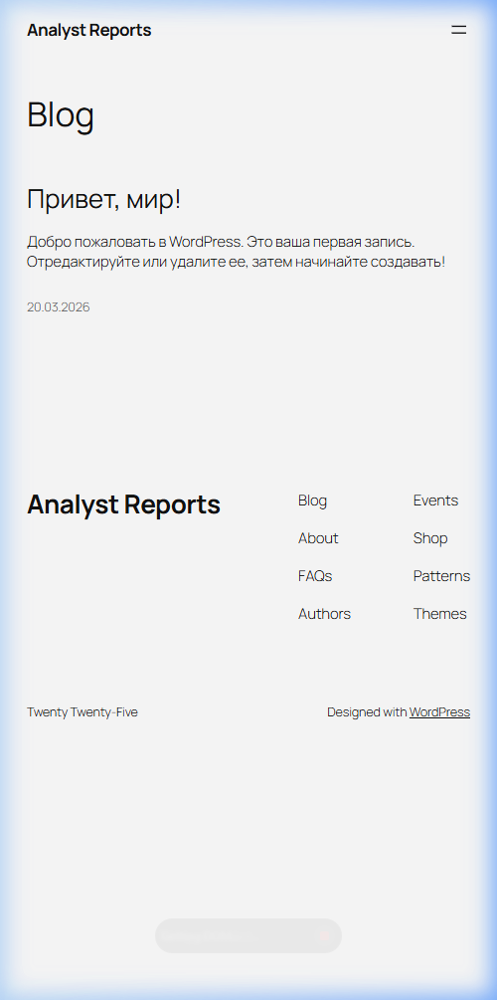
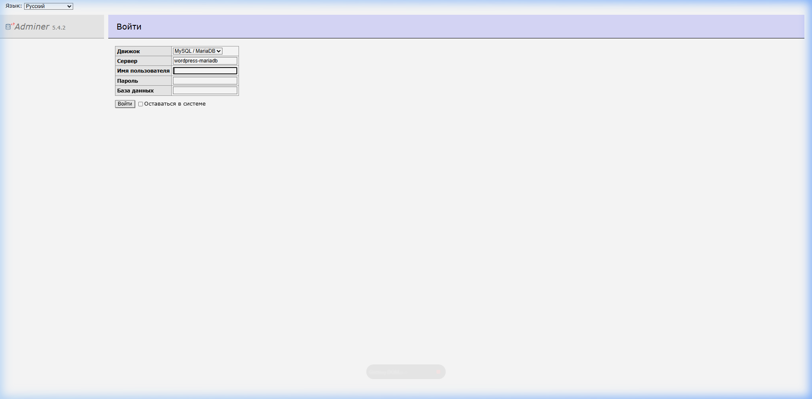

# Отчет по лабораторной работе №3
## Оркестрация контейнеров с помощью Kubernetes

**Студент:** [ФИО]  
**Группа:** [Группа]  
**Вариант:** 14  
**Задача:** Развернуть связку Wordpress + MariaDB + Adminer (GUI для БД) в кластере Kubernetes.

---

### 1. Цель работы
Освоить процесс оркестрации контейнеров. Научиться разворачивать связки сервисов в кластере Kubernetes, управлять их масштабированием (Deployment) и сетевой доступностью (Service).

### 2. Ход выполнения

#### 2.1. Подготовка манифестов
Для работы были созданы манифесты, описывающие конфигурацию подов, сервисов и секретов.

#### 2.2. Листинг и пояснение YAML-файлов

**1. Секреты (`secrets.yaml`)**
```yaml
apiVersion: v1
kind: Secret
metadata:
  name: mysql-pass # Имя секрета для ссылок из других манифестов
type: Opaque
data:
  password: cGFzc3dvcmQ= # Пароль 'password' в кодировке base64
```

**2. База данных (`db-deployment.yaml`)**
```yaml
apiVersion: apps/v1
kind: Deployment
metadata:
  name: wordpress-mariadb
spec:
  selector:
    matchLabels:
      app: wordpress # Селектор для связи Deployment с Pods
      tier: mysql
  template:
    metadata:
      labels:
        app: wordpress
        tier: mysql
    spec:
      containers:
      - image: mariadb:10.6 # Образ БД с Docker Hub
        name: mariadb
        env: # Переменные окружения для настройки БД
        - name: MYSQL_ROOT_PASSWORD
          valueFrom:
            secretKeyRef:
              name: mysql-pass # Ссылка на созданный секрет
              key: password
        ports:
        - containerPort: 3306 # Внутренний порт контейнера MariaDB
          name: mariadb
```

**3. Приложение WordPress (`app-deployment.yaml`)**
```yaml
apiVersion: apps/v1
kind: Deployment
metadata:
  name: wordpress
spec:
  selector:
    matchLabels:
      app: wordpress
      tier: frontend
  template:
    metadata:
      labels:
        app: wordpress
        tier: frontend
    spec:
      containers:
      - image: wordpress:latest # Последняя стабильная версия WordPress
        name: wordpress
        env:
        - name: WORDPRESS_DB_HOST # Имя сервиса БД в качестве хоста
          value: wordpress-mariadb
        - name: WORDPRESS_DB_PASSWORD # Пароль из секретов
          valueFrom:
            secretKeyRef:
              name: mysql-pass
              key: password
        ports:
        - containerPort: 80 # Стандартный HTTP порт WordPress
          name: wordpress
```

**4. Сетевые интерфейсы (`services.yaml` и `adminer-deployment.yaml`)**
- `selector`: Позволяет сервису находить нужные поды по меткам (labels).
- `nodePort: 30080`: Открывает доступ к WordPress снаружи кластера через порт 30080.
- `targetPort`: Порт внутри контейнера, на который перенаправляется трафик.

#### 2.3. Проверка взаимодействия


---

### 3. Результаты

**Интерфейс WordPress (localhost:30080):**


**Интерфейс Adminer (localhost:30081):**


---

### 4. Выводы
Kubernetes позволяет декларативно описывать инфраструктуру. Ключевые параметры, такие как `image`, `ports` и `env`, обеспечивают гибкость настройки, а `selector` — автоматическое связывание компонентов. Использование секретов повышает безопасность при работе с БД.
