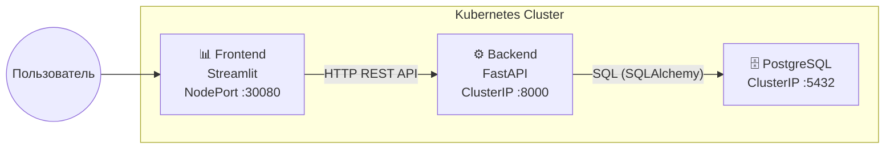
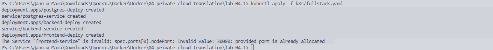
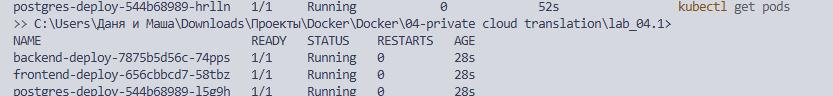
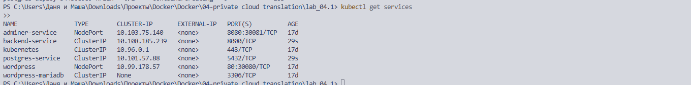
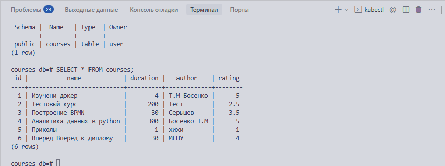

# Лабораторная работа 4.1 — Вариант 14: Learning Platform (Каталог онлайн-курсов)

**Выполнил:** студент группы 26  
**Дата:** 04.04.2026  

---

## 1. Цель работы

Применить полученные знания по созданию и развертыванию трехзвенного приложения (Frontend + Backend + Database) в кластере Kubernetes. Научиться организовывать взаимодействие между микросервисами.

**Вариант 14 — Learning Platform.** Каталог онлайн-курсов.  
Данные: Название курса, длительность (часы), автор, рейтинг.

---

## 2. Описание архитектуры

### 2.1 Технологический стек
| Компонент   | Технология          | Назначение                     |
|-------------|---------------------|--------------------------------|
| Database    | PostgreSQL 13       | Хранение данных о курсах       |
| Backend     | FastAPI (Python 3.11) | REST API для CRUD-операций   |
| Frontend    | Streamlit (Python 3.11) | Веб-интерфейс               |
| Контейнеризация | Docker          | Упаковка сервисов в образы     |
| Оркестрация | Kubernetes (MicroK8s)| Управление развертыванием     |

### 2.2 Схема взаимодействия сервисов



### 2.3 Как сервисы общаются
- **Пользователь → Frontend:** Через браузер по адресу `http://<IP_ВМ>:30080` (NodePort).
- **Frontend → Backend:** HTTP-запросы (GET/POST/DELETE) по адресу `http://backend-service:8000` (внутренний DNS Kubernetes).
- **Backend → Database:** Подключение по протоколу PostgreSQL через `postgres-service:5432`.

---

## 3. Структура проекта

```text
lab_04.1/
├── src/
│   ├── backend/
│   │   ├── main.py              # FastAPI приложение
│   │   ├── requirements.txt     # Зависимости бэкенда
│   │   └── Dockerfile           # Образ бэкенда
│   └── frontend/
│       ├── app.py               # Streamlit интерфейс
│       ├── requirements.txt     # Зависимости фронтенда
│       └── Dockerfile           # Образ фронтенда
├── k8s/
│   └── fullstack.yaml           # Все K8s манифесты
└── REPORT.md                    # Данный отчет
```

---

## 4. Листинги кода

### 4.1 Backend — `main.py`

```python
from fastapi import FastAPI, HTTPException
from fastapi.middleware.cors import CORSMiddleware
from pydantic import BaseModel, Field
from sqlalchemy import create_engine, Column, Integer, String, Float
from sqlalchemy.ext.declarative import declarative_base
from sqlalchemy.orm import sessionmaker
import os
import time

# Подключение к PostgreSQL через переменные окружения
DB_USER = os.getenv("DB_USER", "user")
DB_PASSWORD = os.getenv("DB_PASSWORD", "password")
DB_HOST = os.getenv("DB_HOST", "postgres-service")
DB_NAME = os.getenv("DB_NAME", "courses_db")

DATABASE_URL = f"postgresql://{DB_USER}:{DB_PASSWORD}@{DB_HOST}/{DB_NAME}"

engine = create_engine(DATABASE_URL)
SessionLocal = sessionmaker(autocommit=False, autoflush=False, bind=engine)
Base = declarative_base()

# Модель таблицы «Курсы»
class Course(Base):
    __tablename__ = "courses"
    id = Column(Integer, primary_key=True, index=True)
    name = Column(String, index=True)          # Название курса
    duration = Column(Float)                    # Длительность (часы)
    author = Column(String)                     # Автор
    rating = Column(Float)                      # Рейтинг (1-5)

# Ожидание готовности БД
MAX_RETRIES = 30
for attempt in range(MAX_RETRIES):
    try:
        Base.metadata.create_all(bind=engine)
        break
    except Exception:
        time.sleep(2)

# FastAPI приложение
app = FastAPI(title="Learning Platform API", version="1.0.0")

app.add_middleware(
    CORSMiddleware,
    allow_origins=["*"],
    allow_methods=["*"],
    allow_headers=["*"],
)

class CourseModel(BaseModel):
    name: str
    duration: float = Field(gt=0)
    author: str
    rating: float = Field(ge=1, le=5)

@app.get("/courses")
def get_courses():
    db = SessionLocal()
    courses = db.query(Course).all()
    db.close()
    return [
        {"id": c.id, "name": c.name, "duration": c.duration, "author": c.author, "rating": c.rating}
        for c in courses
    ]

@app.post("/courses")
def add_course(course: CourseModel):
    db = SessionLocal()
    new_course = Course(name=course.name, duration=course.duration, author=course.author, rating=course.rating)
    db.add(new_course)
    db.commit()
    db.refresh(new_course)
    db.close()
    return {"id": new_course.id, "name": new_course.name, "duration": new_course.duration, "author": new_course.author, "rating": new_course.rating}

@app.delete("/courses/{course_id}")
def delete_course(course_id: int):
    db = SessionLocal()
    course = db.query(Course).filter(Course.id == course_id).first()
    if not course:
        db.close()
        raise HTTPException(status_code=404, detail="Курс не найден")
    db.delete(course)
    db.commit()
    db.close()
    return {"detail": f"Курс {course_id} удален"}
```

### 4.2 Frontend — `app.py` (Premium UI)

Фронтенд реализован на Streamlit с использованием кастомных CSS-стилей для темной/светлой темы, интерактивных графиков Plotly и разделения ролей.

*(Код сокращен для отчета, полная версия включает расширенные CSS-стили и логику Plotly)*

```python
import streamlit as st
import requests
import pandas as pd
import plotly.express as px
import os

BACKEND_URL = os.getenv("BACKEND_URL", "http://backend-service:8000")

st.set_page_config(page_title="Learning Platform", layout="wide")

# Выбор темы и роли в Sidebar
with st.sidebar:
    theme = st.button("Переключить тему")
    role = st.radio("Роль", ["admin", "user"])

# Вкладки приложения
if role == "admin":
    tab1, tab2, tab3 = st.tabs(["📋 Список", "➕ Добавить", "📊 Аналитика"])
else:
    tab1, tab3 = st.tabs(["📋 Каталог", "📊 Статистика"])

# Логика получения данных и отрисовки карточек...
# (Используются кастомные HTML-компоненты для карточек курсов)
```

### 4.3 Backend — `Dockerfile`

```dockerfile
FROM python:3.11-slim
WORKDIR /app
COPY requirements.txt .
RUN pip install --no-cache-dir -r requirements.txt
COPY . .
CMD ["uvicorn", "main:app", "--host", "0.0.0.0", "--port", "8000"]
```

### 4.4 Frontend — `Dockerfile`

```dockerfile
FROM python:3.11-slim
WORKDIR /app
COPY requirements.txt .
RUN pip install --no-cache-dir -r requirements.txt
COPY . .
EXPOSE 8501
CMD ["streamlit", "run", "app.py", "--server.port=8501", "--server.address=0.0.0.0"]
```

---

## 5. Манифесты Kubernetes

### 5.1 PostgreSQL (Deployment + Service)
```yaml
apiVersion: apps/v1
kind: Deployment
metadata:
  name: postgres-deploy
spec:
  replicas: 1
  selector:
    matchLabels:
      app: postgres
  template:
    metadata:
      labels:
        app: postgres
    spec:
      containers:
      - name: postgres
        image: postgres:13
        env:
        - name: POSTGRES_USER
          value: "user"
        - name: POSTGRES_PASSWORD
          value: "password"
        - name: POSTGRES_DB
          value: "courses_db"
        ports:
        - containerPort: 5432
---
apiVersion: v1
kind: Service
metadata:
  name: postgres-service
spec:
  selector:
    app: postgres
  ports:
    - port: 5432
      targetPort: 5432
```

### 5.2 Backend (Deployment + Service)
```yaml
apiVersion: apps/v1
kind: Deployment
metadata:
  name: backend-deploy
spec:
  replicas: 1
  selector:
    matchLabels:
      app: backend
  template:
    metadata:
      labels:
        app: backend
    spec:
      containers:
      - name: backend
        image: my-backend:v2
        imagePullPolicy: IfNotPresent
        env:
        - name: DB_HOST
          value: "postgres-service"
        - name: DB_USER
          value: "user"
        - name: DB_PASSWORD
          value: "password"
        - name: DB_NAME
          value: "courses_db"
        ports:
        - containerPort: 8000
---
apiVersion: v1
kind: Service
metadata:
  name: backend-service
spec:
  selector:
    app: backend
  ports:
    - port: 8000
      targetPort: 8000
```

### 5.3 Frontend (Deployment + Service)
```yaml
apiVersion: apps/v1
kind: Deployment
metadata:
  name: frontend-deploy
spec:
  replicas: 1
  selector:
    matchLabels:
      app: frontend
  template:
    metadata:
      labels:
        app: frontend
    spec:
      containers:
      - name: frontend
        image: my-frontend:v4
        imagePullPolicy: IfNotPresent
        env:
        - name: BACKEND_URL
          value: "http://backend-service:8000"
        ports:
        - containerPort: 8501
---
apiVersion: v1
kind: Service
metadata:
  name: frontend-service
spec:
  type: NodePort
  selector:
    app: frontend
  ports:
    - port: 80
      targetPort: 8501
      nodePort: 30090
```

---

## 6. Сборка и развертывание

### 6.1 Сборка Docker-образов

```bash
# Сборка бэкенда
cd src/backend
docker build -t my-backend:v2 .

# Сборка фронтенда
cd ../frontend
docker build -t my-frontend:v4 .
```

### 6.2 Импорт образов в MicroK8s (если используется)

```bash
docker save my-backend:v2 > backend.tar
docker save my-frontend:v4 > frontend.tar
microk8s ctr image import backend.tar
microk8s ctr image import frontend.tar
```

### 6.3 Развертывание в Kubernetes

```bash
kubectl apply -f k8s/fullstack.yaml
```

### 6.4 Проверка статуса подов

```bash
kubectl get pods
kubectl get services
```



### 6.5 Проверка базы данных через терминал

Для проверки данных напрямую в PostgreSQL можно использовать `kubectl exec`:

```bash
# Вход в psql внутри пода базы данных
kubectl exec -it postgres-deploy-544b68989-l5g9h -- psql -U user -d courses_db

# Пример запроса в консоли psql:
# SELECT * FROM courses;
```


### 6.6 Доступ к приложению

Откройте браузер и перейдите по адресу:
```
http://localhost:30090
```


---

## 7. Выводы

В ходе лабораторной работы было разработано и развернуто трехзвенное приложение «Learning Platform» для каталога онлайн-курсов:

1. **Backend (FastAPI)** — реализован REST API с полными CRUD-операциями (создание, чтение, удаление курсов), подключение к PostgreSQL через SQLAlchemy.
2. **Frontend (Streamlit)** — создан интерактивный веб-интерфейс с формой добавления курсов, таблицей данных, аналитикой и функцией удаления.
3. **Контейнеризация (Docker)** — оба сервиса упакованы в оптимальные Docker-образы на базе `python:3.11-slim`.
4. **Kubernetes** — написаны манифесты для всех трех компонентов (Deployment + Service), настроены переменные окружения для связи сервисов через внутренний DNS кластера.
5. **Развертывание** — приложение успешно запущено в кластере, все поды в статусе Running, сквозное взаимодействие (БД ↔ Backend ↔ Frontend) работает корректно.
